# GPPO Project Architecture

This document describes the current software architecture as it exists in the repository now.

It focuses on:

1. CLI entrypoints and wrappers
2. core training and evaluation flow
3. paper-mode orchestration
4. run-directory path resolution
5. visualization and animation flows
6. artifact layout

## 1. Top-Level Entry Points

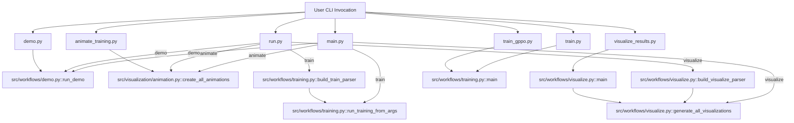

## 2. Module Architecture

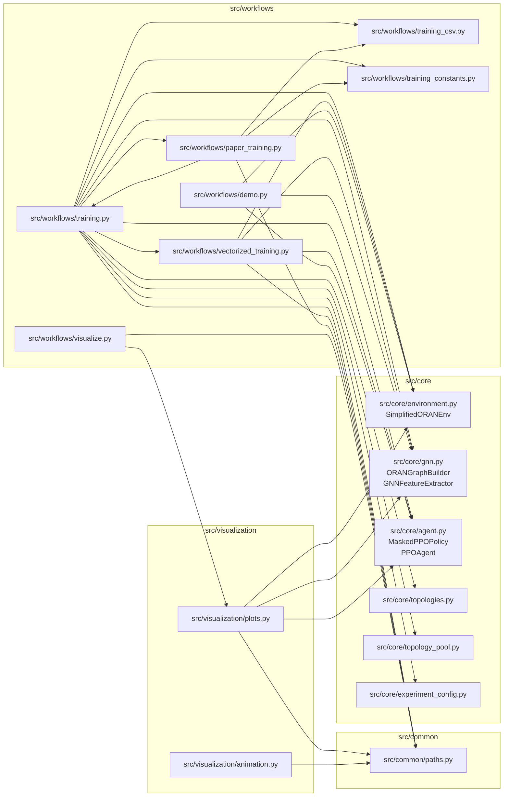

## 3. Run-Directory Path Resolution

The software now treats `--results-path` as either:

- a run directory such as `outputs/my_run`
- or a concrete JSON file such as `outputs/my_run/training_results.json`

This resolution is centralized in `src/common/paths.py`.

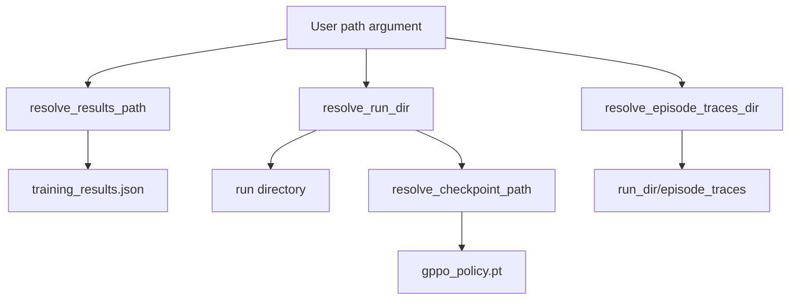

### Current path rules

| Function | File | Purpose |
| --- | --- | --- |
| `resolve_results_path()` | [paths.py](/home/hpcnc/intern-research/src/common/paths.py:25) | Normalizes a run directory or JSON path into the actual results JSON path |
| `resolve_run_dir()` | [paths.py](/home/hpcnc/intern-research/src/common/paths.py:35) | Returns the owning run directory |
| `resolve_checkpoint_path()` | [paths.py](/home/hpcnc/intern-research/src/common/paths.py:38) | Places the checkpoint in the same run directory unless an explicit file path is given |
| `resolve_episode_traces_dir()` | [paths.py](/home/hpcnc/intern-research/src/common/paths.py:51) | Places trace JSON files under `run_dir/episode_traces/` |

## 4. Training Workflow

`run_training_from_args()` is the main orchestrator for project-mode training.

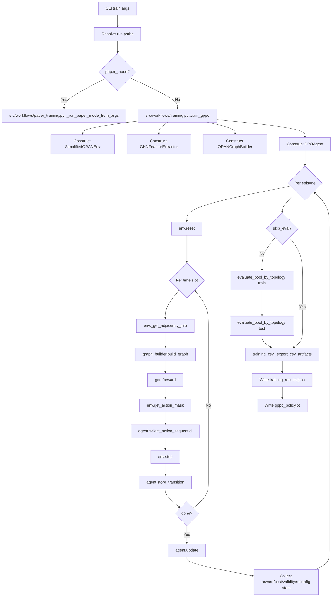

## 5. Vectorized Paper-Mode Training

When `num_envs > 1` or `total_timesteps` is set, `train_gppo()` delegates to the synchronous vectorized path in `src/workflows/vectorized_training.py`.

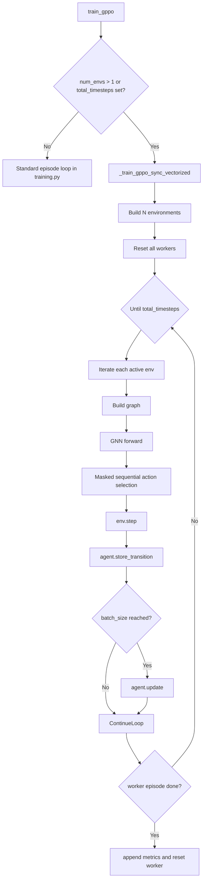

## 6. Paper-Mode Orchestration

Paper mode is a higher-level wrapper around training and evaluation.

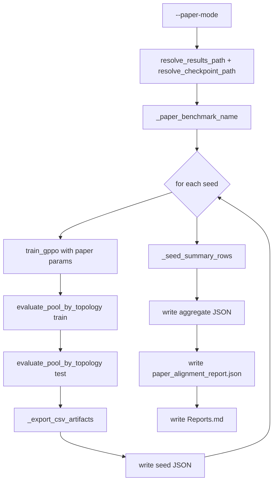

## 7. Environment and Decision Pipeline

The environment executes one paper-style time slot per `step()`.

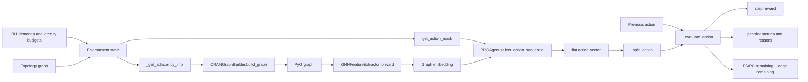

### Core environment methods

| File | Method | Role |
| --- | --- | --- |
| [environment.py](/home/hpcnc/intern-research/src/core/environment.py:173) | `reset()` | Select topology, sample requests, report feasibility diagnostics |
| [environment.py](/home/hpcnc/intern-research/src/core/environment.py:234) | `_split_action()` | Decode flat action into split / ES / RC vectors |
| [environment.py](/home/hpcnc/intern-research/src/core/environment.py:249) | `get_action_mask()` | Structural action masking |
| [environment.py](/home/hpcnc/intern-research/src/core/environment.py:273) | `get_conditional_rc_mask()` | RC mask conditioned on split and ES |
| [environment.py](/home/hpcnc/intern-research/src/core/environment.py:551) | `_evaluate_action()` | Compute validity, costs, penalties, invalid reasons |
| [environment.py](/home/hpcnc/intern-research/src/core/environment.py:710) | `step()` | Convert action metrics into reward, termination, next state, and `info` |

## 8. Evaluation and Trace Export

Evaluation runs the policy deterministically and records traces plus aggregated summaries.

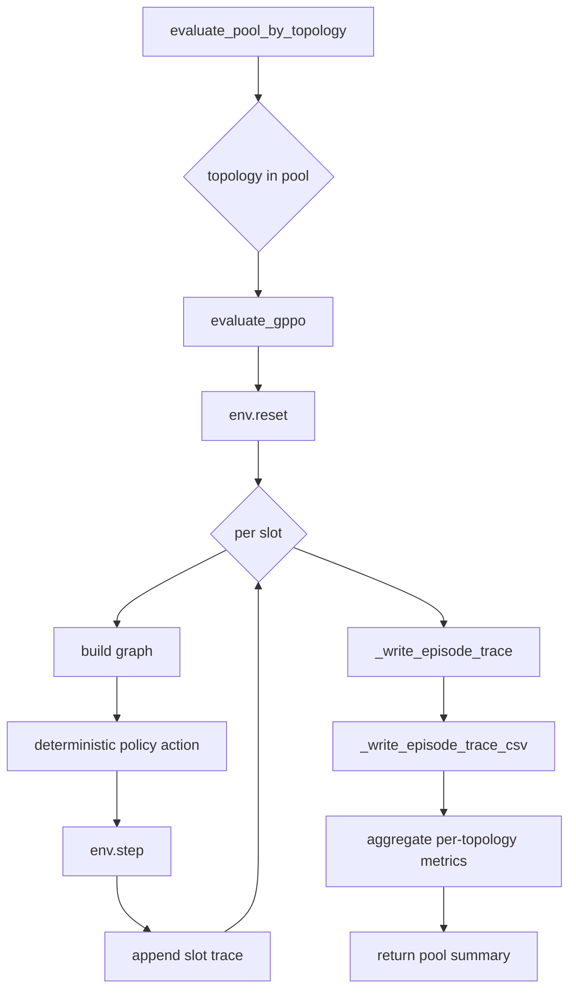

### Trace and CSV responsibilities

| File | Function | Output |
| --- | --- | --- |
| [training.py](/home/hpcnc/intern-research/src/workflows/training.py:79) | `_write_episode_trace()` | Per-episode trace JSON |
| [training_csv.py](/home/hpcnc/intern-research/src/workflows/training_csv.py:66) | `_write_episode_trace_csv()` | Per-episode trace CSV |
| [training_csv.py](/home/hpcnc/intern-research/src/workflows/training_csv.py:238) | `_export_csv_artifacts()` | Run-level CSV summaries |

## 9. Visualization Architecture

The visualization workflow is now compact by default.

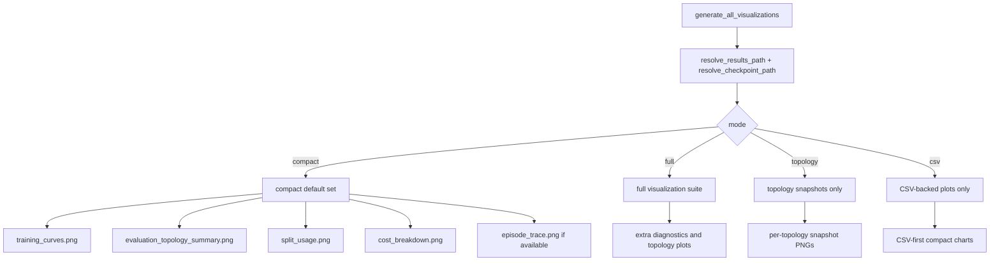

### Default compact output set

| Output | Source |
| --- | --- |
| `training_curves.png` | CSV-backed if available, otherwise JSON-backed |
| `evaluation_topology_summary.png` | CSV-backed if available, otherwise JSON-backed |
| `split_usage.png` | JSON-backed split-usage visualization |
| `cost_breakdown.png` | CSV-backed if available, otherwise JSON-backed |
| `episode_trace.png` | First available episode trace CSV |

### Key visualization methods

| File | Method | Purpose |
| --- | --- | --- |
| [visualize.py](/home/hpcnc/intern-research/src/workflows/visualize.py:99) | `generate_all_visualizations()` | Main visualization orchestrator |
| [plots.py](/home/hpcnc/intern-research/src/visualization/plots.py:363) | `plot_training_curves()` | JSON-backed training overview |
| [plots.py](/home/hpcnc/intern-research/src/visualization/plots.py:643) | `plot_training_metrics_from_csv()` | CSV-backed training overview |
| [plots.py](/home/hpcnc/intern-research/src/visualization/plots.py:586) | `plot_evaluation_topology_summary()` | JSON-backed evaluation summary |
| [plots.py](/home/hpcnc/intern-research/src/visualization/plots.py:731) | `plot_evaluation_topology_summary_from_csv()` | CSV-backed evaluation summary |
| [plots.py](/home/hpcnc/intern-research/src/visualization/plots.py:416) | `plot_split_usage()` | Policy interpretation via split usage |
| [plots.py](/home/hpcnc/intern-research/src/visualization/plots.py:679) | `plot_cost_components_from_csv()` | Cost trend summary |
| [plots.py](/home/hpcnc/intern-research/src/visualization/plots.py:856) | `plot_episode_trace_from_csv()` | Time-slot behavior plot |
| [plots.py](/home/hpcnc/intern-research/src/visualization/plots.py:259) | `NetworkTopologyVisualizer.draw_topology()` | Topology snapshot with optional checkpoint inference |

## 10. Animation Architecture

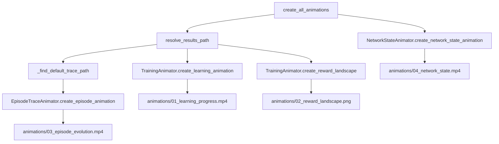

The animation entrypoint now prefers trace JSON files under the same run directory as `--results-path`, then falls back to the global `outputs/episode_traces/` directory.

## 11. Artifact Layout

Current run-directory layout:

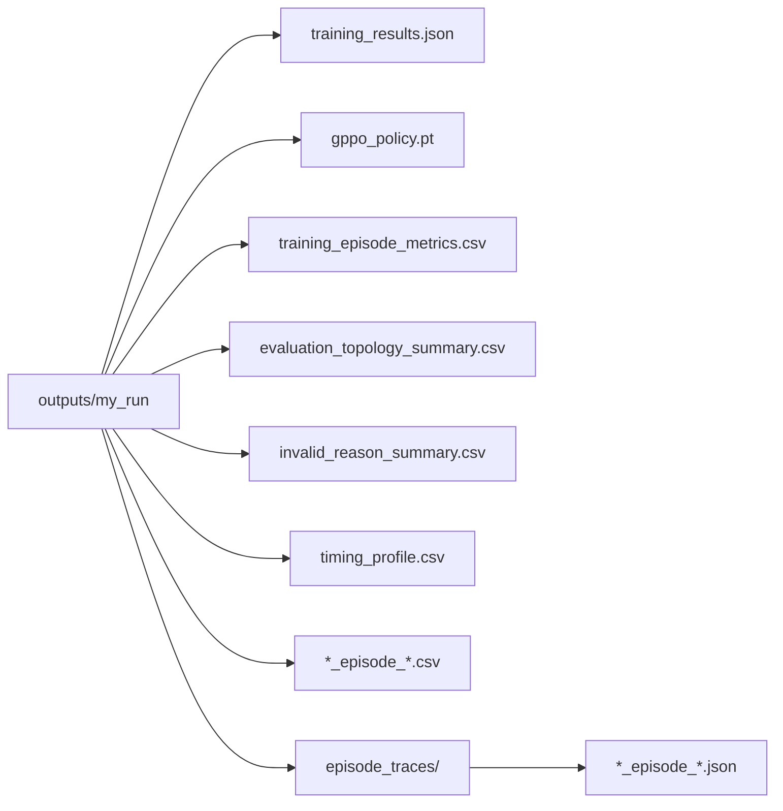

Paper mode adds a nested seed directory structure:

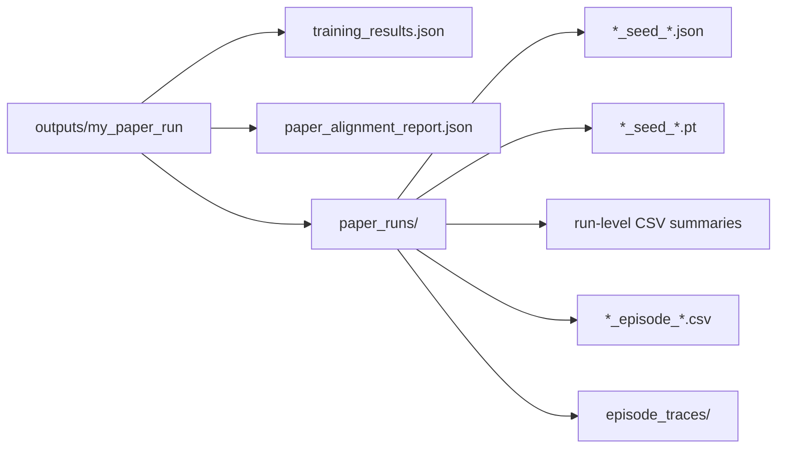

## 12. Current Key Function Map

| File | Function / Class | Calls / Uses | Main output |
| --- | --- | --- | --- |
| `run.py` | `main()` | training, visualize, animate workflows | Convenience task router |
| `main.py` | `main()` | same workflows via subcommands | Alternative CLI entrypoint |
| `src/workflows/training.py` | `run_training_from_args()` | path resolution, `train_gppo()`, evaluation, CSV export | Full train/eval workflow |
| `src/workflows/training.py` | `train_gppo()` | env, GNN, graph builder, PPO agent | Standard training path |
| `src/workflows/vectorized_training.py` | `_train_gppo_sync_vectorized()` | multi-env synchronous rollout | Paper/vectorized training path |
| `src/workflows/paper_training.py` | `_run_paper_mode_from_args()` | multi-seed orchestration | Aggregate paper-mode run |
| `src/workflows/training.py` | `evaluate_gppo()` | deterministic policy rollout, trace export | Per-topology evaluation summary |
| `src/workflows/training.py` | `evaluate_pool_by_topology()` | repeated `evaluate_gppo()` | Pool-wide evaluation summary |
| `src/workflows/visualize.py` | `generate_all_visualizations()` | mode-based plot orchestration | Compact/full visualization output |
| `src/visualization/animation.py` | `create_all_animations()` | learning animation, reward landscape, episode animation, network animation | MP4/PNG animation assets |
| `src/common/paths.py` | path resolvers | run-dir normalization | Consistent artifact placement |

