# GPPO Project Architecture

This document now follows the requirements in `INSTRUCTION.md`.

It covers two views:

1. the current code-mapped architecture that exists in the repository today
2. the required revised architecture for GPPO baseline reproduction, centered on controlled topology management

The key requirement from `INSTRUCTION.md` is that the environment must move from a single implicit topology to an explicit experiment structure with fixed benchmark topologies, train/test topology pools, and reset-time topology selection.

## 1. Top-Level Entry Points

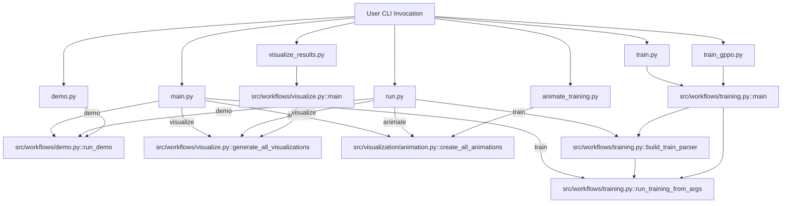

## 2. Source Module Architecture

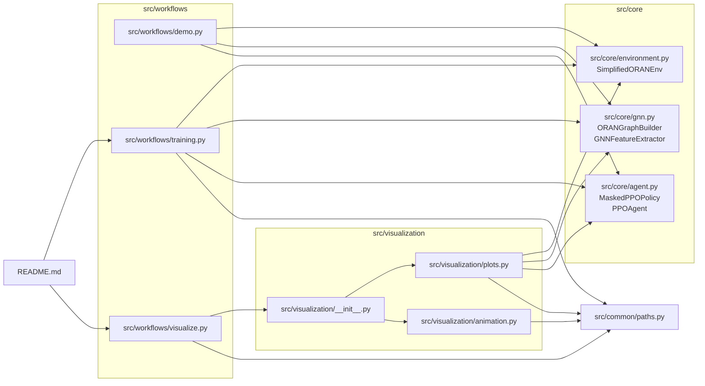

## 3. Current vs Required Environment Design

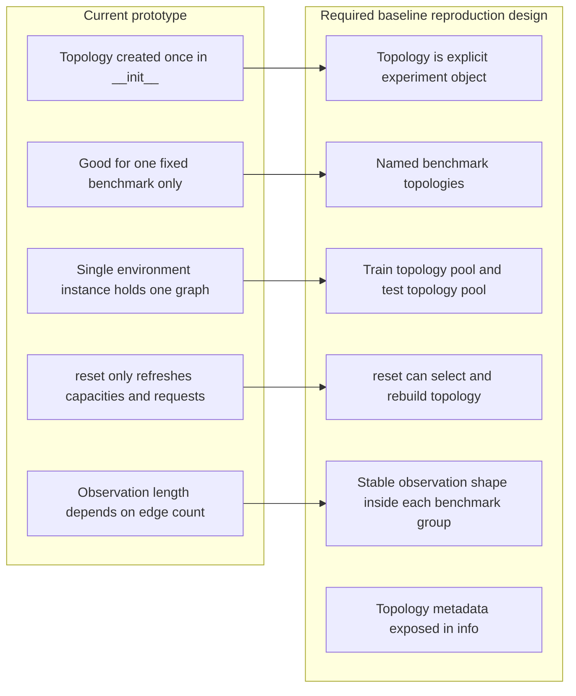

## 4. Current Training Pipeline

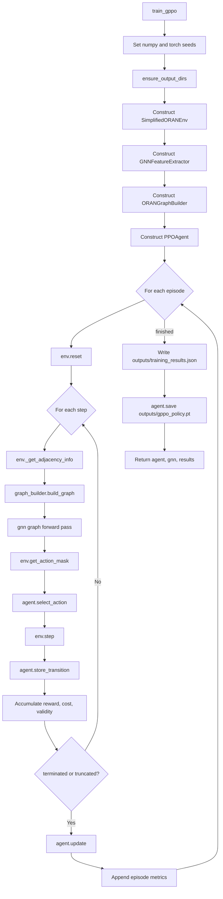

## 5. Current Training Runtime Data Flow

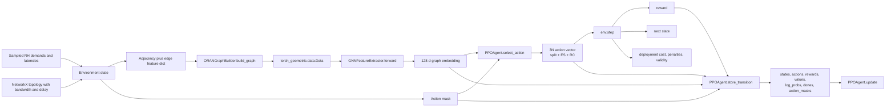

## 6. Required Paper-Aligned Topology Architecture

This is the target architecture implied by `INSTRUCTION.md`. It is the design the project should follow before adding GPU-aware or mobility-aware extensions.

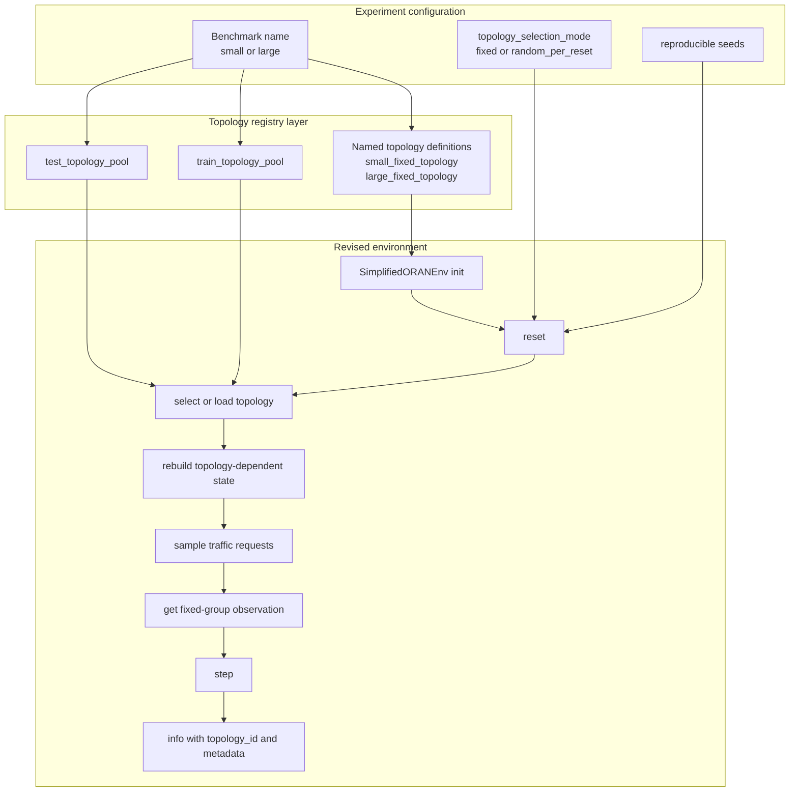

## 7. Required Reset-Time Topology Reload Flow

This is the main environment change requested by `INSTRUCTION.md`.

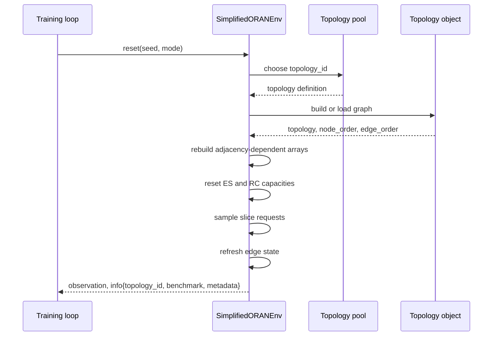

## 8. Required Topology-Pool Training Pipeline

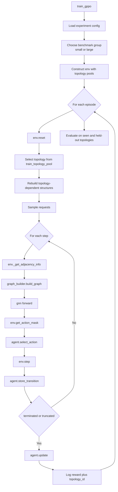

## 9. Benchmark Group Constraint

`INSTRUCTION.md` recommends keeping observations stable within each benchmark group instead of supporting arbitrary graph sizes immediately.

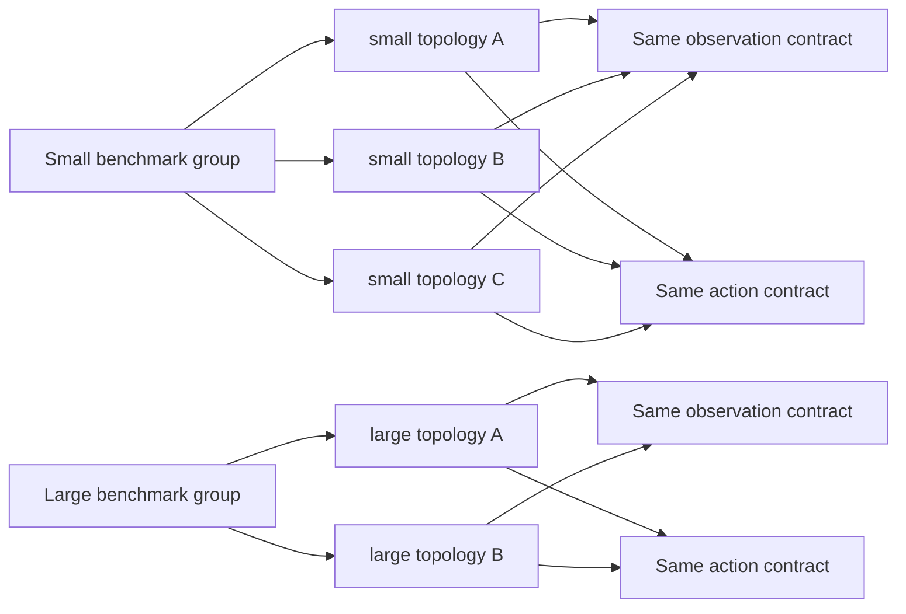

## 10. Visualization and Animation Pipeline

```mermaid
flowchart TD
    Results[outputs/training_results.json]
    Checkpoint[outputs/gppo_policy.pt]

    VisualizeEntrypoint[src/workflows/visualize.py::generate_all_visualizations]
    AnimateEntrypoint[src/visualization/animation.py::create_all_animations]

    VisualizeEntrypoint --> EnsureVizDirs[ensure_output_dirs]
    AnimateEntrypoint --> EnsureAnimDirs[ensure_output_dirs]

    Checkpoint --> TopologyViz[NetworkTopologyVisualizer.draw_topology]
    Checkpoint --> InferDims[NetworkTopologyVisualizer.infer_topology_from_checkpoint]
    InferDims --> TopologyViz

    VisualizeEntrypoint --> ActionViz[ActionSpaceVisualizer.plot_action_space]
    VisualizeEntrypoint --> CostViz[CostBreakdownVisualizer.plot_cost_components]
    Results --> CurvesViz[TrainingVisualization.plot_training_curves]
    Results --> StatsViz[TrainingVisualization.plot_statistics]
    VisualizeEntrypoint --> BaselineViz[PerformanceComparison.plot_baseline_comparison]

    TopologyViz --> Png1[visualizations/01_network_topology.png]
    ActionViz --> Png2[visualizations/02_action_space.png]
    CostViz --> Png3[visualizations/03_cost_breakdown.png]
    CurvesViz --> Png4[visualizations/04_training_curves.png]
    StatsViz --> Png5[visualizations/05_phase_analysis.png]
    BaselineViz --> Png6[visualizations/06_baseline_comparison.png]

    Results --> LearnAnim[TrainingAnimator.create_learning_animation]
    Results --> RewardLandscape[TrainingAnimator.create_reward_landscape]
    AnimateEntrypoint --> NetAnim[NetworkStateAnimator.create_network_state_animation]

    LearnAnim --> Gif1[animations/01_learning_progress.gif]
    RewardLandscape --> Img2[animations/02_reward_landscape.png]
    NetAnim --> Gif3[animations/03_network_state.gif]
```

## 11. Key Function Call Map

| File | Function / Class | Calls / Uses | Output |
|---|---|---|---|
| `main.py` | `main()` | `run_demo()`, `run_training_from_args()`, `generate_all_visualizations()`, `create_all_animations()` | Dispatches subcommands |
| `run.py` | `main()` | `build_train_parser()`, same workflow functions as `main.py` | Convenience task router |
| `src/workflows/training.py` | `train_gppo()` | `SimplifiedORANEnv`, `GNNFeatureExtractor`, `ORANGraphBuilder`, `PPOAgent` | Trained agent, GNN, metrics dict, checkpoint, JSON results |
| `src/workflows/training.py` | `evaluate_gppo()` | `env.reset()`, `build_graph()`, `gnn()`, `agent.select_action()`, `env.step()` | Printed evaluation metrics |
| `src/workflows/training.py` | `run_training_from_args()` | `train_gppo()`, optionally `evaluate_gppo()` | Full train workflow from CLI args |
| `src/workflows/demo.py` | `run_demo()` | `demo_environment()`, `demo_gnn()`, `demo_ppo_agent()`, `demo_integration()` | Printed sanity-check demo output |
| `src/workflows/visualize.py` | `generate_all_visualizations()` | Visualization classes from `src.visualization` and `ensure_output_dirs()` | PNG charts in `visualizations/` |
| `src/core/environment.py` | `reset()` | `_sample_requests()`, `_refresh_edge_state()`, `_get_state()` | Current behavior: initial observation and empty info dict |
| `src/core/environment.py` | `get_action_mask()` | topology queries | Boolean masks for split, ES, and RC actions |
| `src/core/environment.py` | `step()` | `_evaluate_action()`, `_refresh_edge_state()`, `_sample_requests()`, `_get_state()` | Next state, reward, terminated, truncated, info |
| `src/core/environment.py` | `_get_adjacency_info()` | topology edge scan | Adjacency matrix, edge feature dict, node order |
| `src/core/gnn.py` | `ORANGraphBuilder.build_graph()` | current environment arrays plus adjacency/edge features | `torch_geometric.data.Data` graph |
| `src/core/gnn.py` | `GNNFeatureExtractor.forward()` | `GINEConv`, `global_mean_pool` | Graph embedding tensor |
| `src/core/agent.py` | `PPOAgent.select_action()` | `MaskedPPOPolicy.get_distributions()` | Action vector, log-prob, value |
| `src/core/agent.py` | `PPOAgent.store_transition()` | rollout buffer append | In-memory trajectory data |
| `src/core/agent.py` | `PPOAgent.compute_advantages()` | stored rewards, values, dones | GAE advantages and returns |
| `src/core/agent.py` | `PPOAgent.update()` | `compute_advantages()`, `policy.get_distributions()`, optimizer step | Updated policy parameters |
| `src/visualization/animation.py` | `create_all_animations()` | `TrainingAnimator`, `NetworkStateAnimator`, `ensure_output_dirs()` | GIF and PNG animation assets |
| `src/common/paths.py` | `ensure_output_dirs()` | `Path.mkdir()` | Creates `outputs/`, `visualizations/`, `animations/` |

## 12. Required Environment Refactor Map

This section translates `INSTRUCTION.md` into concrete code responsibilities.

| Required capability | Current status | Needed code change |
|---|---|---|
| Fixed named topologies | Missing | Add named topology definitions instead of one internal random generator |
| Train/test topology pools | Missing | Add topology pool objects or config lists with topology IDs |
| Reset-time topology selection | Missing | Move topology selection and rebuild logic into `reset()` |
| Reproducible benchmark configs | Partial | Add experiment-level config for benchmark, seed, topology mode |
| Stable observation inside benchmark group | Partial | Keep edge and node layout fixed within a benchmark pool |
| Topology metadata in `info` | Missing | Return `topology_id`, benchmark name, and topology metadata |
| Cross-topology evaluation | Missing | Separate seen-topology and held-out-topology evaluation paths |

## 13. Compatibility Layer

These files are wrappers or re-exports, not the main implementation:

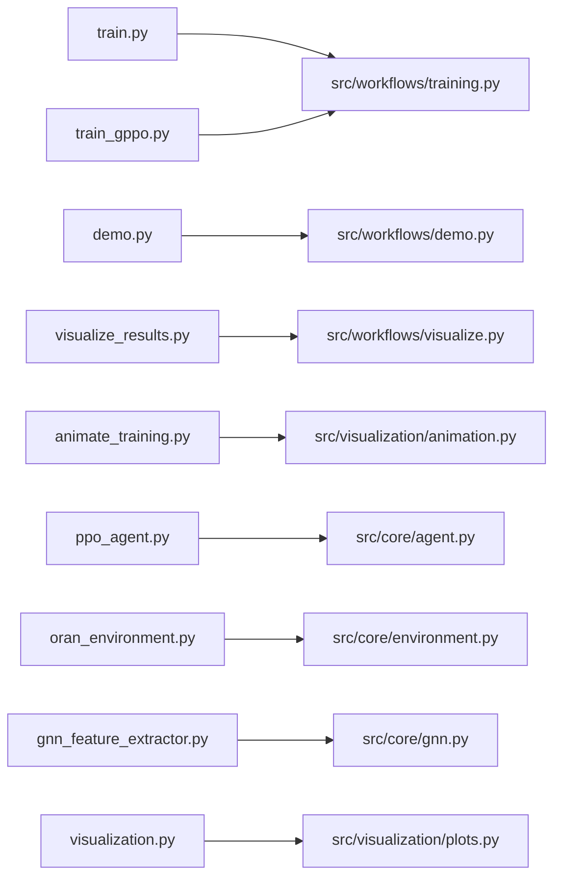

## 14. Proposed File-Level Revision Plan

This is the cleanest file-level architecture that follows the instruction while preserving the current baseline action and reward logic.

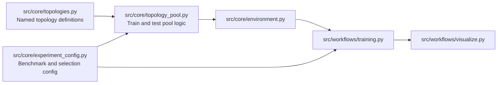

## 15. Artifact Summary

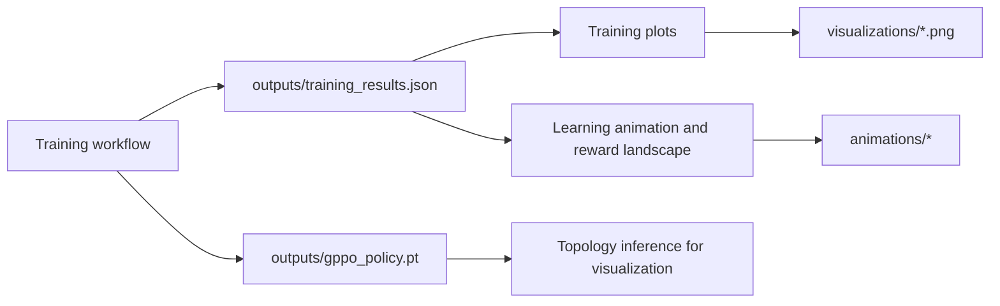
